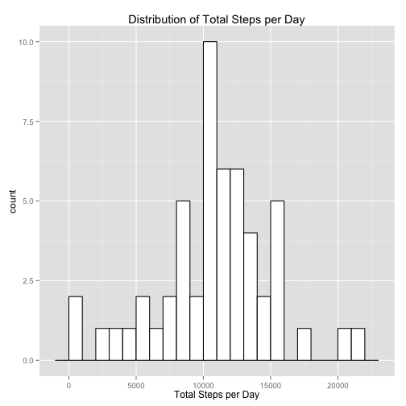
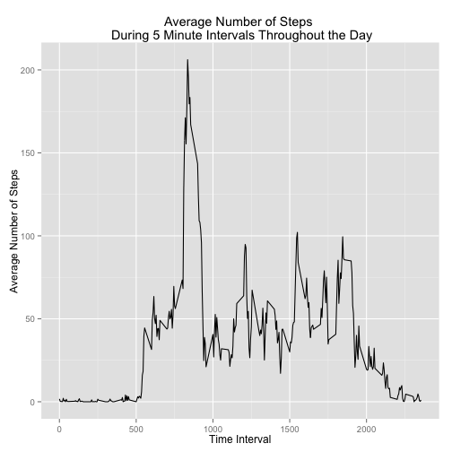
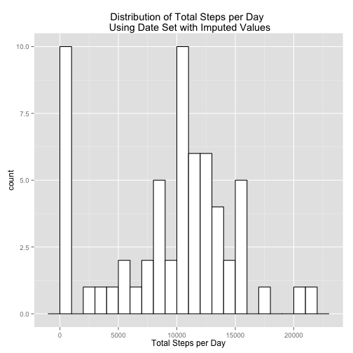
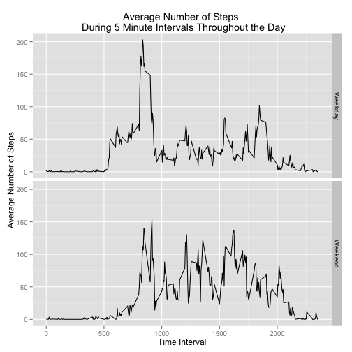

**Reading in the data**  
To begin with, you must download the data set from [this website](https://d396qusza40orc.cloudfront.net/repdata%2Fdata%2Factivity.zip) and save it into your working directory. Assign the path of your directory to the variable Rep_Research. After you load the data, the only thing you need to fix is the class of the date variable


```r
Rep_Research <- "/Users/sommpd10/datasciencecoursera/Reproducible-Research"
setwd(Rep_Research)
url <- "https://d396qusza40orc.cloudfront.net/repdata%2Fdata%2Factivity.zip"
file <- "activity"
download.file(url, file, method = "curl")
unzip(file, exdir = Rep_Research)
data <- read.csv("activity.csv", header=TRUE)
data$date <- as.Date(data$date, format = "%Y-%m-%d")
```

**Question 1**  
For this question, you must calculate the total number of steps taken each day and make a histogram showing the distribution of the number of steps taken every day.

First, make a table:

```r
Daily_Sums <- aggregate(data$steps, by = list(data$date), FUN = "sum")
colnames(Daily_Sums) <- c("Date", "Total_Steps")
head(Daily_Sums)
```

```
##         Date Total_Steps
## 1 2012-10-01          NA
## 2 2012-10-02         126
## 3 2012-10-03       11352
## 4 2012-10-04       12116
## 5 2012-10-05       13294
## 6 2012-10-06       15420
```

Next, make the plot:

```r
library(ggplot2)
ggplot(Daily_Sums, aes(x = Total_Steps)) + geom_histogram(binwidth = 1000, fill="white", color="black") + labs(title="Distribution of Total Steps per Day", x = "Total Steps per Day")
```

 

Lastly, calculate the mean and median:

```r
Q1mean <- mean(Daily_Sums$Total_Steps, na.rm=TRUE)
Q1median <- median(Daily_Sums$Total_Steps, na.rm=TRUE)
```

The mean is 1.0766 &times; 10<sup>4</sup> and the median is 10765.

**Question 2**  
For this question, you must explore daily trends of steps taken during 5 minute intervals throughout the day.

First, make a table (and note that to calculate means, you must drop all missing values):

```r
data_noNAs <- data[!is.na(data$steps), ]
Interval_Means <- aggregate(data_noNAs$steps, by = list(data_noNAs$interval), FUN = "mean")
colnames(Interval_Means) <- c("Time_Interval", "Mean_Steps")
head(Interval_Means)
```

```
##   Time_Interval Mean_Steps
## 1             0    1.71698
## 2             5    0.33962
## 3            10    0.13208
## 4            15    0.15094
## 5            20    0.07547
## 6            25    2.09434
```

Next, make the plot:

```r
library(ggplot2)
g <- ggplot(Interval_Means, aes(x = Time_Interval, y = Mean_Steps))
g + geom_line() + labs(title="Average Number of Steps \n During 5 Minute Intervals Throughout the Day", x = "Time Interval", y = "Average Number of Steps")
```

 

Lastly, find the period during the day with the largest average number of steps:

```r
Max_Interval <- Interval_Means[which.max(Interval_Means[, 2]), 1]
Max_Value <- Interval_Means[which.max(Interval_Means[, 2]), 2]
```

Maximum number of steps during a 5 minute period is 206.1698 and this takes place during the interval beginning at 835.

**Question 3**  
For this question, you must impute the missing values for number of steps during a given time interval and then recalculate the distribution of total number of steps taken every day.

First, calculate the number of rows with missing data:

```r
number_missingq3 <- (nrow(data) - sum(complete.cases(data)))
```
We find that 2304 rows have missing data.

Next, I impute missing values for number of steps during a given time interval with the average number of steps during that interval. This is a three step process: calculate average number of steps during every interval (calculated above), add a column with the average number of steps during each interval, replace NAs with the average for that given interval.

```r
data_NAs_Imputed <- merge(data, Interval_Means, by.x = "interval", by.y = "Time_Interval", all.x = TRUE)
data_NAs_Imputed$steps[is.na(data_NAs_Imputed$steps)] <- data_NAs_Imputed$Mean_Steps
```

```
## Warning: number of items to replace is not a multiple of replacement
## length
```
To ensure that missing values are replaced, calculate the number of rows with missing values:

```r
number_missingq3b <- (nrow(data_NAs_Imputed$steps) - sum(complete.cases(data_NAs_Imputed$steps)))
number_missingq3b
```

```
## numeric(0)
```

The next step is to recalculate the total number of steps taken every day using the new data set with imputed values:

```r
Daily_Sums_Imputed <- aggregate(data_NAs_Imputed$steps, by = list(data_NAs_Imputed$date), FUN = "sum")
colnames(Daily_Sums_Imputed) <- c("Date", "Total_Steps")
head(Daily_Sums_Imputed)
```

```
##         Date Total_Steps
## 1 2012-10-01       128.9
## 2 2012-10-02       126.0
## 3 2012-10-03     11352.0
## 4 2012-10-04     12116.0
## 5 2012-10-05     13294.0
## 6 2012-10-06     15420.0
```

The last step is to calculate the new mean and median value for total number of steps taken per day as well as to plot a new histogram:

```r
Mean_Imputed <- mean(Daily_Sums_Imputed$Total_Steps, na.rm=TRUE)
Median_Imputed <- median(Daily_Sums_Imputed$Total_Steps, na.rm=TRUE)

ggplot(Daily_Sums_Imputed, aes(x = Total_Steps)) + geom_histogram(binwidth = 1000, fill="white", color="black") + labs(title="Distribution of Total Steps per Day \n Using Date Set with Imputed Values", x = "Total Steps per Day")
```

 

Below, we can compare the mean and median values from the two data sets:   
- Without Imputation: mean = 1.0766 &times; 10<sup>4</sup> and median = 10765  
- With Imputation: mean = 9371.4371 and median = 1.0395 &times; 10<sup>4</sup>

We can see that both the mean and median decreased after imputing missing values of steps during 5 minute intervals with averages.

**Question 4**  
For this question, you must compare the number of steps taken during 5 minute intervals during days in the week versus days in the weekend.

First, you must create a new variable that indicates whether the date is a weekday or weekend and make sure to use the data set with imputed values:

```r
data_NAs_Imputed$Weekday <- ifelse(weekdays(data_NAs_Imputed$date) != "Saturday" & weekdays(data_NAs_Imputed$date) != "Sunday", "Weekday", "Weekend")
data_NAs_Imputed$Weekday <- as.factor(data_NAs_Imputed$Weekday)
```

The next step is to create a table that calculates the average number of steps taken during 5 minute intervals for weekdays and for weekend days:

```r
Interval_Means_Weekday <- aggregate(data_NAs_Imputed$steps, by = list(data_NAs_Imputed$Weekday, data_NAs_Imputed$interval), FUN="mean")
names(Interval_Means_Weekday) <- c("Weekday", "Interval", "Mean_Steps")
head(Interval_Means_Weekday)
```

```
##   Weekday Interval Mean_Steps
## 1 Weekday        0     2.2512
## 2 Weekend        0     0.2146
## 3 Weekday        5     0.6289
## 4 Weekend        5     0.2146
## 5 Weekday       10     0.3845
## 6 Weekend       10     0.2146
```

The last step is to plot daily trends of steps taken throughout the day during weekdays and weekend days:

```r
library(ggplot2)
g <- ggplot(Interval_Means_Weekday, aes(x = Interval, y = Mean_Steps))
g + geom_line() + facet_grid(Weekday ~ .) + labs(title="Average Number of Steps \n During 5 Minute Intervals Throughout the Day", x = "Time Interval", y = "Average Number of Steps")
```

 
